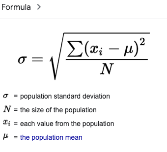

I have provided some references and short explanations but in general I really recommend you to google your own tutorials that fit the best for the way you understand things. 

# THINGS TO GO THROUGH IN ORDER TO PROPERLY UNDERSTAND THIS TOPIC

## TOPIC_ORDER 

1. Normal Distribution
2. [Standard Deviation](#std)
3. Standard Normal Distribution 
4. Z score, Z value 
5. [Central limit theorem](#clt)
6. [What IS Confidence interval ](https://www.mathsisfun.com/data/confidence-interval.html) [My own explanation](#confidence-interval)
7. [Intuitive explanation of confidence interval which also explains p-value](https://www.youtube.com/watch?v=TqOeMYtOc1w)
8. [Derivation of Confidence interval](https://online.stat.psu.edu/stat415/lesson/2)
# CLT

The proof for central limit theorem is very theoretical and we wont cover it here but the result of CLT is that
taking n samples with Size N point estimates will have a normal distribution with characteristics shown on the below image. [Refernce to a good explanation](https://sphweb.bumc.bu.edu/otlt/MPH-Modules/BS/BS704_Probability/BS704_Probability12.html#:~:text=The%20central%20limit%20theorem%20states,will%20be%20approximately%20normally%20distributed.)

# STD 

# Confidence Interval

With a confidence interval we have a lower bound L and upper bound U and we claim that we are X percent sure that the global estimate lies in this bound. [look at the example here](https://www.mathsisfun.com/data/confidence-interval.html)
