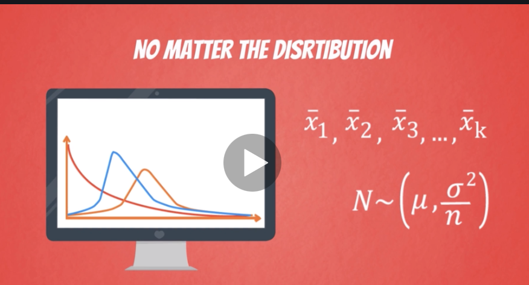

# THINGS TO GO THROUGH IN ORDER TO PROPERLY UNDERSTAND THIS TOPIC

1. Need to know Normal Distribution
2. Standard Deviation
3. Standard Normal Distribution 
4. Z score, Z value 
5. [Central limit theorem](#clt)
6. [Derivation of Confidence interval](https://online.stat.psu.edu/stat415/lesson/2)

# CLT

