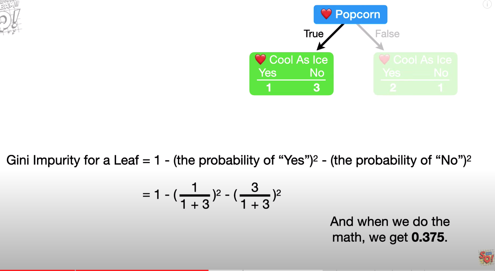
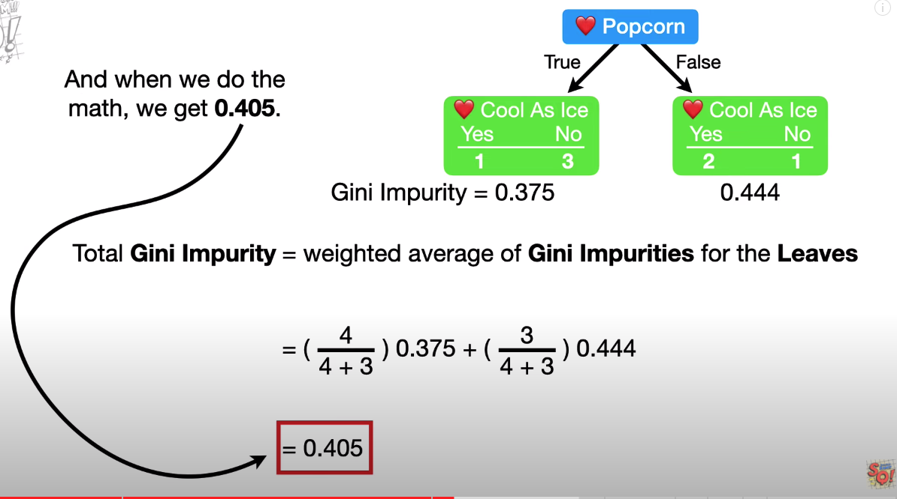

[Why XGboost](https://towardsdatascience.com/https-medium-com-vishalmorde-xgboost-algorithm-long-she-may-rein-edd9f99be63d) XGBoost is a decision-tree-based ensemble Machine Learning algorithm that uses a gradient boosting framework. In prediction problems involving **unstructured data (images, text, etc.) artificial neural networks tend to outperform all other algorithms or frameworks**. However, when it comes to **small-to-medium structured/tabular data, decision tree based algorithms are considered best-in-class right now.** Please see the chart below for the evolution of tree-based algorithms over the years. 

+ Compared to PLAIN GRADIENT BOOSTING,XGBOOST approaches training differently. Its rather an implementation than a model. **It even has its own [github repo](https://github.com/dmlc/xgboost/)

# PRELIMINARIES

## INTUITION BEHIND

+ Conceptually its very similiar to Gradient Boosting but its faster and very parallelizable. . 

+ Decision trees - [If you have basic idea of decision trees, start watching from 6:30](https://www.youtube.com/watch?v=_L39rN6gz7Y)
+ Bagging - 
+ Ensemble learning - many weak are strong together - 
+ Gradient Boosting - improve the previous predictions by trying to predict errors 

# DECISION TREES 

## ALGORITHM FOR BUILDING DECISION TREES 

1. Calculate Gini index for all columns. 
2. Choose the column with lowest Gini index as split point and split 
3. Recursively go down the tree

### HOW TO CALCULATE GINI INDEX

+ For binary categories (0,1;True,False) calculate Gini index. 
  + 
  + 
+ For numeric values [Watch 10:01 from this video](https://www.youtube.com/watch?v=_L39rN6gz7Y)

# REFERENCES 

+ [A fantastic overview of all the components of XGboost and what are its advantages](https://towardsdatascience.com/https-medium-com-vishalmorde-xgboost-algorithm-long-she-may-rein-edd9f99be63d)